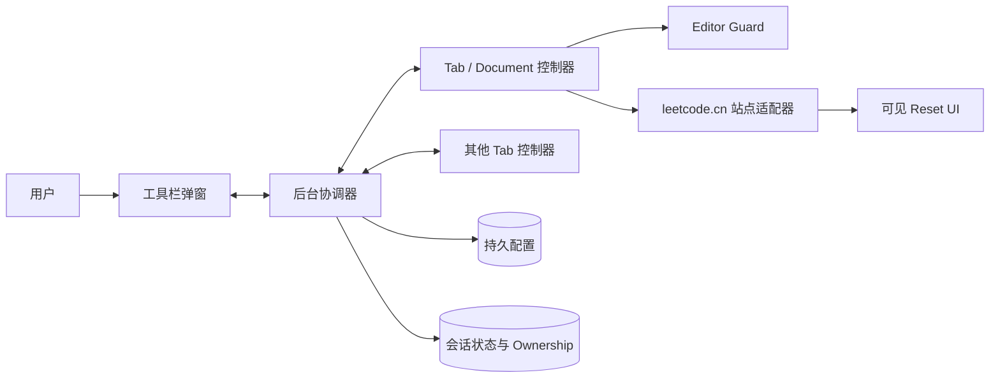
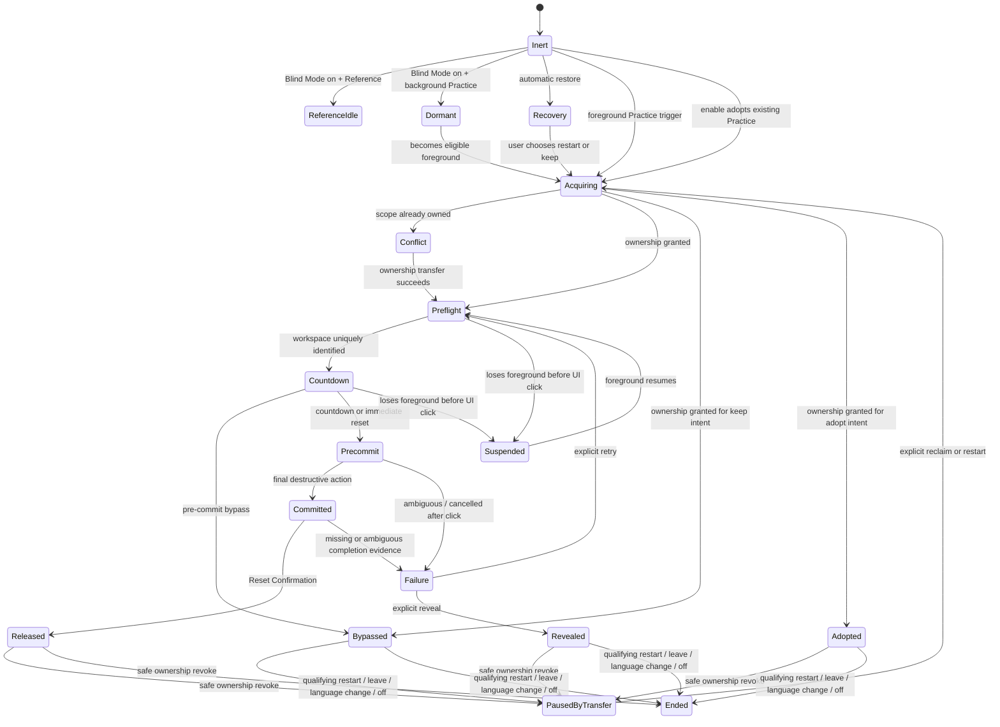

# LeetCode Blind Review Mode 设计规格

状态：设计已确认；实现前仍需完成登录态 `leetcode.cn` DOM contract 取证  
目标版本：V1  
目标平台：桌面版 Google Chrome（Manifest V3，普通浏览模式）  
目标站点：已登录的 `https://leetcode.cn`

相关文档：

- [领域词汇表](../../CONTEXT.md)
- [ADR-0001：采用最小化 Chrome Extension](../adr/0001-use-a-minimal-chrome-extension.md)
- [ADR-0002：只使用可见 Reset UI](../adr/0002-use-visible-reset-ui-as-the-only-write-path.md)
- [ADR-0003：保持 Content-Blind 与本地运行](../adr/0003-remain-content-blind-and-local-only.md)
- [ADR-0004：同题同语言实行单标签页 Attempt Ownership](../adr/0004-enforce-single-tab-attempt-ownership.md)
- [测试方案](../testing/leetcode-blind-review-mode-test-plan.md)

## 1. Problem Statement

LeetCode 会恢复用户此前在代码编辑器中留下的草稿。这个行为适合继续做题，却会破坏盲复习：旧答案即使只显示极短时间，也可能向用户泄露解法结构、变量设计或关键思路。

用户需要的不是“进入页面后自动点击 Reset”，而是一个受保护的重新开始流程：在旧代码有机会被看见之前遮挡 Coding Workspace，通过 LeetCode 自己的 Reset 交互恢复当前语言的默认模板，获得足够的流程完成证据后才把编辑器交还给用户。

该工具本身具有破坏性。错误的重复 Reset、迟到的异步回调、后台标签页静默操作或跨标签页竞态，都可能覆盖用户正在写的草稿。因此，防泄露与防误删必须同时成为一等约束。

## 2. Motivation

Blind Review Mode 服务于这样一种日常练习方式：一道题即使曾经 Accepted，也不代表用户已经真正掌握。重新练习时，用户希望从默认模板开始，而不是从旧答案的视觉提示开始。

核心价值按优先级排序如下：

1. 在受支持、已测试的路径上尽最大可能避免旧代码闪现。
2. 绝不因 Observer、SPA 重渲染或迟到任务而重复 Reset。
3. 用户主动导航、取消、关闭和接管优先于自动流程。
4. 页面或 Selector 变化时安全失败，不猜测破坏性目标。
5. 保持 Content-Blind，不为校验而读取或保存答案。

## 3. Goals

- 识别 `leetcode.cn` 标准 Practice Problem 与 Practice View。
- 在完整页面载入和受支持的 SPA 导航路径上尽早启用 Editor Guard。
- 通过 `leetcode.cn` 可见的 Reset UI 恢复当前编程语言的默认模板。
- 在流程级 Reset Confirmation 后一次性解锁整个 Coding Workspace。
- 明确定义 Blind Attempt、Blind Restart、Released Attempt、Bypassed Entry、Dormant Entry 与 Recovery Entry 的生命周期。
- 每个 Blind Attempt 只自动获得一份 Reset Authorization。
- 路由、语言、模式与所有权变化能原子取消旧 generation，并清理全部异步资源。
- 以 30 秒前台活动时间预算限制自动流程，以 Guarded Failure 结束不确定状态。
- 提供全局 Blind Mode、当前题 Blind Restart、Attempt Bypass、Retry、诊断与跨标签页 Ownership Transfer。
- 不影响 Submission History，不运行或提交代码，不改变题目数据。

## 4. Non-Goals

- 不自动 Run 或 Submit。
- 不读取、分析、复制、散列或备份代码。
- 不读取测试用例、Console、运行结果或 Submission 内容。
- 不直接修改 `localStorage`、IndexedDB、Editor model、React 状态或 Monaco／CodeMirror 内部对象。
- 不调用 LeetCode 私有后端 API 或 GraphQL 作为 Reset 路径。
- 不判断题目是否 solved、attempted 或 Accepted。
- 不支持比赛、Assessment、Explore 内嵌练习、Playground 或其他特殊 Editor 页面。
- 不支持 `leetcode.com`、移动浏览器、Firefox、Edge 或无痕模式。
- 不承诺任何环境下绝对零帧泄露。
- 不在 V1 提供题目排除列表、Only solved、AI、批量处理或复杂设置页。

## 5. Solution

V1 是一个最小化 Chrome Manifest V3 Extension。Blind Mode 首次安装默认关闭；开启后，Extension 为后续新 Document 注册首帧 Guard CSS 与控制脚本，并在当前活动 Practice View 立即启动 Blind Restart。其他已经打开的标签页不会被批量 Reset。

一个正常的新 Blind Attempt 的用户体验是：

```text
识别到前台 Practice View
        ↓
全视口 Editor Guard
        ↓
确认 Problem Identity、语言与 Coding Workspace
        ↓
Guard 缩小到整个 Coding Workspace
        ↓
显示 5 秒可取消窗口
   ↙                    ↘
保留当前草稿         立即或倒计时后 Reset
   ↓                    ↓
Bypassed Entry       驱动 LeetCode Reset UI
                         ↓
                  Reset Confirmation
                         ↓
                    Released Attempt
```

五秒窗口位于 Coding Workspace 内。题目描述仍可阅读和滚动。用户可以点击“立即盲重置”或按 `Enter` 跳过等待，也可以点击“保留当前草稿”或按 `Esc` 执行 Attempt Bypass。

成功后只短暂显示“LeetCode 重置流程已完成”并淡出，不在网页内保留常驻 UI。该文案只表达流程级 Reset Confirmation，不声称逐字验证模板内容。Blind Mode 状态由 Extension 图标与工具栏弹窗承载。

## 6. UX 与行为定义

### 6.1 Blind Mode 总开关

- 首次安装默认关闭。
- 开关状态跨标签页、浏览器重启持久化。
- 开启时只立即 Reset 当前活动 Practice View；其他既有 Practice View 保留当前代码并被纳管为 Adopted Entry，不被批量 Reset。
- Adopted Entry 申请其同题同语言 Ownership；若多个既有标签页 scope 相同，当前活动页优先，其他页进入 Ownership Conflict，而不是继续裸露并发编辑。
- 关闭时取消所有 workflow、结束所有 Attempt、释放所有 Ownership、移除 Guard，并使已注入控制器功能性惰性化。
- 关闭发生在 Reset Commit Point 前，保证 Extension 尚未覆盖草稿。
- 关闭发生在 Reset Commit Point 后，只能停止后续动作，不能撤销 LeetCode 已接受的 Reset。

### 6.2 Blind Restart 触发

以下事件在 Practice View 中表达新的 Blind Restart 或 Blind Attempt：

- 用户按 F5、点击浏览器刷新或执行明确的页面 Reload。
- 从其他 Problem Identity 或非题目页面进入 Practice View。
- 离开题目后通过链接、前进或后退再次进入。
- 切换编程语言。
- 在当前活动 Practice View 上开启 Blind Mode。
- 点击工具栏弹窗中的“重新盲写当前题”。

Run、Submit、测试结果更新、布局变化、Editor 重挂载或普通 DOM mutation 不属于 Blind Restart。

### 6.3 Practice View 与 Reference View

- Description／标准做题视图是 Practice View。
- Solutions 与 Submissions 是 Reference View。
- 直接进入 Reference View 时不 Guard、不 Reset、不创建 Blind Attempt。
- 已有 Released Attempt 或 Bypassed Entry 时，在同题同语言的 Practice View 与 Reference View 之间往返不会 Reset。
- 从外部直接进入 Reference View，随后首次进入 Practice View 时，才创建 Blind Attempt。
- 在五秒窗口内进入 Reference View 会取消尚未开始点击的本轮流程；返回 Practice View 时重新给出完整五秒窗口。
- Reset UI 点击序列已经开始后再离开，Reset Authorization 已消耗；返回 Practice View 时进入 Guarded Failure，不自动再试。
- Reference View 中的 Reload 或语言变化只结束旧 entry，不操作 Reset；之后进入 Practice View 才开始新的 Attempt。

### 6.4 前台、后台与自动恢复

- 只有当前 Chrome 窗口中的前台活动标签页可以倒计时、取得 Ownership 或操作 Reset。
- 后台 Practice View 是 Dormant Entry：保持必要 Guard，但没有计时器、超时或点击权限。
- 成为前台后才开始或恢复剩余的前台活动时间预算。
- Chrome 会话恢复、崩溃恢复、Memory Saver 自动重载或 Extension 恢复产生 Recovery Entry。
- Recovery Entry 不自动 Reset；用户必须明确选择“重新盲写”或“保留当前草稿”。
- 两种选择都必须先取得同题同语言 Attempt Ownership；若另一个恢复标签页已取得 Ownership，则进入 Conflict，而不是直接揭示或 Reset。

### 6.5 成功、跳过与失败

- Reset Confirmation 完成后产生 Released Attempt。
- Released Attempt 是单向锁：同一 entry 内任何 Observer 或重渲染都不能再次自动 Reset。
- Attempt Bypass 只能发生在 Commit Point 前，并产生 Bypassed Entry。
- Bypassed Entry 与 Released Attempt 一样禁止迟到 Reset，直到 entry 结束或发生新 Blind Restart。
- 不确定状态进入 Guarded Failure；自动流程停止，Guard 保留。
- Commit Point 前的失败可提供“重试”“保留当前草稿”“关闭 Blind Mode”“复制诊断信息”。
- Commit Point 后只能提供“显示当前 Editor 状态”，不能承诺原草稿仍存在；Retry 必须明确标记为新的破坏性授权。

### 6.6 多标签页

- Attempt Ownership 的 key 是规范化的 Problem Identity 与语言标识。
- 同一 key 同时只能有一个 owner。
- 第二个标签页保持 Guard 并显示冲突，不得自动 Reset。
- 用户可以显式 Ownership Transfer。
- Transfer 必须先让旧 owner 取消 workflow、遮挡 Coding Workspace、停止编辑且返回匹配 epoch 的确认；随后才向新 owner 授权。
- 旧 owner 的内存代码不由 Extension 清除。
- 旧 owner 无响应时不得强行接管；只有能证明旧 Document 已消失时才清理陈旧 Ownership。

## 7. Scope

| 项目 | V1 边界 |
| --- | --- |
| 浏览器 | 桌面版 Google Chrome 稳定版，普通浏览模式 |
| 扩展模型 | Manifest V3 |
| 站点 | `https://leetcode.cn` |
| 账号 | 已登录的普通账号会话 |
| 页面 | 标准 `/problems/{slug}/...` 页面家族 |
| Practice View | Description／标准做题视图 |
| Reference View | Solutions、Submissions 及其已验证的详情子路径 |
| 题目状态 | solved、attempted、never attempted 全部一致处理 |
| 语言 | 标准 Editor 提供且通过适配器验证的语言 |
| 不支持 | Contest、Assessment、Explore、Playground、未知题目子路由 |

未知路由或不支持页面不会猜测 Reset 目标。初始分类明确为不支持时立即中和 Guard 并保持无操作；已确认是 Practice View 但 Coding Workspace 或 Reset contract 无法唯一识别时进入 Guarded Failure。

## 8. User Stories

1. 作为日常刷题用户，我希望重新进入题目时看不到旧答案，以便从头思考。
2. 作为日常刷题用户，我希望恢复当前语言的默认模板，以便马上开始盲写。
3. 作为用户，我希望 Extension 首次安装默认关闭，以免安装即清空草稿。
4. 作为用户，我希望明确开启 Blind Mode 后状态能跨浏览器重启保持。
5. 作为用户，我希望开启 Blind Mode 时只立即处理当前标签页，以免其他已打开题目被批量清空。
6. 作为用户，我希望可以从工具栏立即重新盲写当前题，而不必完整刷新页面。
7. 作为用户，我希望 F5 明确表示重新开始，以便用熟悉操作快速重置。
8. 作为用户，我希望 Run Code 不触发 Reset，以免调试过程中丢失代码。
9. 作为用户，我希望 Submit 和结果面板更新不触发 Reset，以免正常做题被打断。
10. 作为用户，我希望进入新题时旧题 workflow 被取消，以免迟到点击作用到新页面。
11. 作为用户，我希望离开一道题再返回时重新开始，以符合我的复习习惯。
12. 作为用户，我希望切换语言时目标语言先被 Guard 和 Reset，以免看到该语言的旧答案。
13. 作为用户，我希望 Description、Solutions 与 Submissions 之间的普通往返不清除当前 Attempt。
14. 作为用户，我希望直接查看 Solutions 或 Submissions 时不被自动 Reset 打断。
15. 作为用户，我希望从 Reference View 真正进入做题视图时才开始 Blind Attempt。
16. 作为用户，我希望在 Guard 期间仍能阅读和滚动题目描述。
17. 作为用户，我希望有五秒时间决定保留草稿，以免必须关闭全局模式。
18. 作为用户，我希望可以按 `Enter` 立即开始 Reset，以免每次都等待五秒。
19. 作为用户，我希望可以按 `Esc` 保留当前草稿，以便快速执行 Attempt Bypass。
20. 作为用户，我希望跳过后当前 entry 永远不会被迟到 Observer Reset。
21. 作为用户，我希望成功解锁后 Extension 不再监视我的输入来猜测我是否开始写题。
22. 作为用户，我希望成功后页面恢复干净，不保留悬浮控件。
23. 作为用户，我希望 Reset 失败时旧代码继续受保护，而不是因超时自动显示。
24. 作为用户，我希望失败界面说明当前处于 Commit Point 前还是之后，以便理解草稿风险。
25. 作为用户，我希望失败后只有我的 Retry 能再次授权 Reset。
26. 作为用户，我希望自动流程最长只消耗 30 秒前台活动时间，以免无限等待。
27. 作为用户，我希望切到后台时流程暂停，以免在我看不到时静默清稿。
28. 作为用户，我希望后台打开多道题时不会批量 Reset。
29. 作为用户，我希望 Chrome 自动恢复页面时先询问我，以免恢复中的草稿被当作主动刷新清空。
30. 作为用户，我希望浏览器主动刷新与自动恢复有不同语义。
31. 作为用户，我希望同题同语言的第二个标签页不能与当前草稿竞争。
32. 作为用户，我希望接管前先暂停旧标签页，以免两个 Reset 同时发生。
33. 作为用户，我希望接管不会由 Extension 主动清除旧标签页内存中的代码。
34. 作为用户，我希望旧标签页无响应时系统宁可停止，也不要强行接管。
35. 作为用户，我希望关闭 Blind Mode 能立即停止所有后续自动点击。
36. 作为用户，我希望在 Commit Point 前关闭时得到“不由 Extension 覆盖”的保证。
37. 作为用户，我希望界面明确说明 Commit Point 后无法撤销，以便正确理解关闭模式的安全边界。
38. 作为注重隐私的用户，我希望 Extension 永不读取或保存代码。
39. 作为注重隐私的用户，我希望 Extension 不发送遥测或网络请求。
40. 作为用户，我希望 Submission History 完全不受影响。
41. 作为用户，我希望所有破坏性写入都经过 LeetCode 可见 Reset UI。
42. 作为用户，我希望 UI 改版时安全失败，而不是回退到内部 API 或浏览器存储写入。
43. 作为维护者，我希望失败诊断包含状态和候选数量，但不包含页面内容。
44. 作为维护者，我希望 Selector 必须在正确作用域内唯一匹配，避免点击相同文案的错误按钮。
45. 作为维护者，我希望每个异步回调都绑定 generation，避免旧任务复活。
46. 作为维护者，我希望可通过确定性 fixture 重现菜单、确认框、延迟与改版失败。
47. 作为维护者，我希望用真实 Chrome 验证首帧 Guard，而不是只做 DOM 单元测试。
48. 作为维护者，我希望发布前通过登录态人工 smoke test 验证当前 `leetcode.cn` contract。
49. 作为用户，我希望规格如实描述防泄露为受支持路径上的强力 best-effort，以便不形成绝对安全的错误预期。
50. 作为用户，我希望未知或未支持用途保持无操作，例如 Contest 和 Assessment。
51. 作为已经打开多个练习标签页的用户，我希望开启 Blind Mode 时这些页面保留代码但进入 Ownership 管理，以便既不被批量 Reset，也不继续制造同 scope 并发风险。

## 9. 行为矩阵

| 场景 | Guard | Reset | 结果 |
| --- | --- | --- | --- |
| Blind Mode 关闭时进入 Practice View | 否 | 否 | Extension inert |
| Blind Mode 已开启，前台首次进入 Practice View | 是 | 是 | 新 Blind Attempt |
| 开启 Blind Mode 时的当前活动 Practice View | 是 | 是 | 新 Blind Attempt |
| 开启时已存在的其他、不同 scope Practice 标签页 | 否 | 否 | 保留代码并成为 Adopted Entry／owner |
| 开启时已存在的同 scope 重复标签页 | 是 | 否 | 当前活动页优先；其他进入 Ownership Conflict |
| Blind Mode 已开启后在后台新开 Practice View | Dormant Guard | 激活后 | Dormant Entry，激活后新 Attempt |
| 直接进入 Solutions／Submissions | 否 | 否 | Reference View |
| Released：Description → Reference → Description | Reference 中否 | 否 | 延续 Released Attempt |
| Bypassed：Description → Reference → Description | Reference 中否 | 否 | 延续 Bypassed Entry |
| 五秒窗口 → Reference → Description | 返回时是 | 返回后是 | 取消旧 pending flow，创建新 Attempt |
| Reset UI 点击后进入 Reference | 保持安全状态 | 不再自动点击 | 返回 Practice 时 Guarded Failure |
| Practice View 中 F5／刷新 | 是 | 是 | Blind Restart |
| Reference View 中 F5／刷新 | 否 | 否 | 结束旧 entry；仍为 Reference View |
| Chrome 自动恢复 Practice View | 是 | 由用户选择 | Recovery Entry |
| 换题或离开后返回 | 是 | 是 | 新 Blind Attempt |
| 切换语言或切回原语言 | 是 | 是 | 新 Blind Attempt |
| Run／Submit／布局变化／Editor 重挂载 | 否 | 否 | 当前终态不变 |
| 工具栏命令位于 Practice View | 是 | 是 | Blind Restart |
| 工具栏命令位于 Reference／不支持页面 | 否 | 否 | 命令禁用并给出非破坏性提示 |
| 同题同语言第二标签页 | 是 | 否 | Ownership Conflict |
| Ownership Transfer 成功 | 新 owner 保持 Guard | 新 owner 获得授权后 | 旧 owner 进入暂停覆盖状态 |
| 关闭 Blind Mode | 全部解除 | 不新增 | 全部 Attempt 结束并释放 Ownership |

## 10. Implementation Decisions

### 10.1 总体架构

Extension 由四个职责边界组成：

1. **后台协调器**：管理全局模式、动态激活、会话状态、前台资格、Attempt Ownership、Transfer epoch 与工具栏命令。
2. **每 Document 控制器**：解析 route、维护 generation 与状态机、管理 Guard、驱动站点适配器、执行取消和 cleanup。
3. **站点适配器**：封装当前登录态 `leetcode.cn` 的 Coding Workspace、语言控件、Reset menu／dialog 与 Reset Confirmation contract。
4. **工具栏弹窗**：提供 Blind Mode 开关、当前题 Blind Restart、当前页面状态与非敏感诊断入口。



后台协调器是跨标签页状态的唯一授权者。每个 Document 控制器只持有其当前 generation 的局部能力，不能自行修改 Ownership。站点适配器没有绕开可见 UI 的备用写入路径。

### 10.2 Manifest 与权限

V1 只申请实现当前设计所需的最小权限：

- 针对 `https://leetcode.cn/problems/*` 的精确 host permission。
- Extension 配置与会话协调所需的 storage 权限。
- Blind Mode 开启／关闭时动态注册或注销内容控制器与 Guard CSS 所需的 scripting 权限。

V1 不申请 cookies、webRequest、history、unlimitedStorage、`<all_urls>` 或远程代码权限。无痕模式明确禁用。除非实现验证证明不可避免，否则不申请 broad tabs 权限；标签消息与激活查询优先依赖精确 host permission 和标准 Tabs 能力。

### 10.3 激活与首帧 Guard

Blind Mode 开启时，后台协调器动态注册两个概念角色：

- 对标准题目 URL 家族生效的轻量 route controller；
- 在初始 Practice View 上先于页面 DOM 显示的 Guard CSS 与 `document_start` bootstrap。

bootstrap 必须在页面 DOM 构建前同步完成 URL 分类：

- Practice View 保持全视口 Guard。
- 已知 Reference View 或不支持路由立即中和 Guard，且不得产生可见闪屏。
- 无法分类的路径按不支持处理；不得仅因 URL 含 `/problems/` 就执行 Reset。

动态注册只影响后续新 Document。开启 Blind Mode 时，当前活动 Practice View 通过一次显式 Guard 注入立即 Blind Restart；其他已经打开的匹配 Practice View 安装被动 controller，保留代码并成为 Adopted Entry。它们不自动 Reset，但必须申请其 scope 的 Ownership；同 scope 重复页进入 Conflict。Adopted Entry 之后只有发生 Reload、换题、重新进入、换语言或用户命令等合格触发时才结束并进入正常 Blind Attempt 生命周期。

关闭 Blind Mode 时先把全局状态写为 disabling/off，再注销动态注册、广播取消与解除 Guard、清空会话状态。Chrome 注销内容脚本不会物理移除已经注入当前 Document 的 JavaScript/CSS，因此控制器必须能被显式中和；完整卸载等待下一次 Document 导航。

### 10.4 状态存储

持久配置只保存：

- Blind Mode 的 off／enabling／on／disabling 状态；
- 五秒窗口等非敏感配置；
- 配置 schema version。

会话级 storage 保存：

- 规范化 problem slug 与语言标识；
- tab、Document、Attempt、generation 与 epoch 标识；
- Attempt Ownership 与 Transfer 中间态；
- 有界、脱敏的诊断 ring buffer。

浏览器重启后清空 Attempt、Ownership 与诊断，但保留 Blind Mode 配置。后台 Service Worker 可随时休眠，因此权威会话状态不得只放在 worker 内存中。内容脚本不能直接写权威 Ownership；必须通过后台协调器请求状态转换。

### 10.5 Problem Identity 与路由分类

Problem Identity 由 `leetcode.cn` origin 与规范化 problem slug 组成。query、hash、Study Plan 参数以及 Description／Solutions／Submissions 视图不改变 Problem Identity。

route classifier 使用严格 allowlist：

- Practice：标准 Description／做题视图。
- Reference：Solutions、Submissions 及经登录态实测确认仍属于同题的详情路径。
- Unsupported：Contest、Assessment、Explore、Playground、未知子路由和非标准 Editor 页面。

分类以 pathname segment 为主，不匹配完整 URL，也不依赖页面随机 class。未知路由永远不能自动升级为 Practice。

### 10.6 Blind Attempt 状态机

内部状态名称用于实现和测试；面向用户的文案必须使用 `CONTEXT.md` 中的领域词。

| 状态 | 含义 | 允许的破坏性能力 |
| --- | --- | --- |
| Inert | Blind Mode 关闭或页面不支持 | 无 |
| Reference Idle | 当前为 Reference View，且没有继续中的 entry | 无 |
| Dormant Entry | 新 Practice View 位于后台 | 无 Ownership、无 timer、无点击 |
| Recovery Entry | Chrome 自动恢复或来源不确定 | 必须先由用户选择 |
| Acquiring Ownership | 前台 Practice View 正在申请独占 scope | 无 |
| Ownership Conflict | 该 scope 已有 owner | 无 |
| Guarded Preflight | 全视口 Guard，定位语言与 Coding Workspace | 无 |
| Five-second Countdown | Workspace Guard，可立即 Reset 或 Attempt Bypass | 未消费 Authorization |
| Reset Pre-commit | Reset UI 点击序列已开始 | Authorization 已消费，尚可确认未过 Commit Point |
| Reset Committed | 已越过 Commit Point，只观察完成证据 | 不得再发破坏性点击 |
| Released Attempt | Reset Confirmation 后解锁 | 永久无自动 Reset 权限 |
| Bypassed Entry | 用户在 Commit 前保留草稿 | 永久无自动 Reset 权限 |
| Adopted Entry | Blind Mode 开启时保留的既有 Practice View | 永久无自动 Reset 权限，持有 Ownership |
| Revealed Entry | 用户从不确定失败中揭示当前 Editor | 永久无自动 Reset 权限 |
| Guarded Failure | 自动流程终止，Guard 保留 | 只有显式 Retry 可签发新授权 |
| Suspended Attempt | Preflight／Countdown 失去前台 | Ownership 保留，timer 与点击暂停 |
| Paused by Transfer | 旧 owner 已被覆盖并停止编辑 | 无 |
| Ended | entry／generation 作废 | 无 |



Reset Authorization 在第一次执行 Reset UI 点击序列时消费，而不是等到 Commit Point 才消费。Commit Point 只界定“Extension 是否还能保证没有覆盖草稿”。如果当前 UI 没有二次确认，则 Reset menu item 本身同时是第一次点击后的破坏点；这一事实必须由登录态 DOM contract 取证决定。

Reference View 转移按当前状态精确定义：

| 离开 Practice 时的状态 | 进入 Reference 的处理 | 返回 Practice 的处理 |
| --- | --- | --- |
| Released／Bypassed／Adopted／Revealed | 保留原终态与 Ownership，不 Reset | 延续原终态，不 Reset |
| Guarded Preflight／Countdown，尚未点击 Reset UI | 取消 pending flow、释放 Ownership，进入 Reference Idle | 创建新 Attempt，重新提供完整五秒窗口 |
| Reset Pre-commit／Committed，Authorization 已消费 | 停止一切后续点击，保留 uncertain scope 与 Ownership；Reference 本身不 Guard | 直接显示 Guarded Failure，只有显式 Retry／Reveal 能继续 |
| Reference Idle | 保持无操作、无 Ownership | 首次进入 Practice 时申请 Ownership 并创建 Attempt |

这张表是状态机的一部分；DOM route observer 只能上报 view change，不能自行决定 Reset。

### 10.7 前台资格与 30 秒预算

自动流程拥有最多 30 秒的**累计前台活动时间预算**，从前台合格页面首次显示 Guard 并开始自动协调时计起，包含 Ownership acquisition、Guarded Preflight、五秒窗口与 Reset observation。Dormant Entry、Recovery Entry 等待用户期间、纯 Conflict 等待用户期间以及 Suspended Attempt 的后台时间不计入预算。

预算规则：

- 预算不可因 Observer、页面重挂载或 phase 切换而续期。
- 自动 Ownership 请求、后台协调器应答与消息重试必须消费同一预算；协调器无响应不能无限保持自动等待。
- 剩余预算不足以提供完整五秒窗口时，不缩短窗口、不仓促 Commit，直接进入 Guarded Failure。
- 在任何 Reset UI 点击之前失去前台，转为 Suspended Attempt，保存剩余预算；重新前台时重新验证页面和 Ownership，再恢复完整、安全的下一步。
- Reset UI 点击序列已经开始但尚未 Commit 时失去前台，因结果可能含糊而进入 Guarded Failure。
- Commit 后失去前台只允许观察既有操作；不得继续点击。重新前台时若无法确认结果，进入 Guarded Failure。

这一“前台活动时间”表述是对原始 30 秒 wall-clock 保险丝的安全化细化：后台永远没有自动点击权限，也不会因为 Chrome timer throttling 产生迟到 Reset。

### 10.8 SPA Route Handling

初始 Document、F5 与浏览器 Reload 由预注入 Guard 保护。同 Document SPA 不会重新运行内容脚本，因此 controller 必须长驻但保持无破坏性默认状态。

正常受支持路径采用以下信号：

- 标准 Navigation API（可用时）；
- 捕获阶段的题目链接与已实测语言控件交互；
- `popstate`、`pageshow`、`pagehide` 与 visibility／window activation；
- URL 与最小 DOM observation 作为验证和补充检测，而不是 Reset 授权来源。

每次合格 route／language 变化都先同步升起 Guard，再原子递增 generation、Abort 旧 generation，最后启动新分类。所有异步回调必须捕获 generation、Document identity 与 AbortSignal；任何一项不匹配都只能退出，不能点击、解锁或转移 Ownership。

若上下文变化发生在任何 Reset UI 点击之前，旧 pending flow 可以干净取消。若 Reset Authorization 已消费但尚无确定终态，则把原 problem-language scope 标记为 uncertain：不再允许旧 generation 点击；目标上下文按自身规则处理；之后返回 uncertain scope 时直接进入 Guarded Failure，只有显式 Retry 或 Reveal 能继续。

V1 不 patch React、Editor internals 或 LeetCode 私有 router。若站点绕过已测试的 Navigation／link／language paths 直接替换 Editor，Extension 可能只能事后发现；这是明确的 best-effort 限制，而不是启用内部劫持的理由。

BFCache 规则：

- `pagehide` 时结束离开的 entry、停止 click authority、释放或冻结 Ownership，并尽可能恢复首帧 Guard 状态。
- `pageshow` 返回时重新读取 Blind Mode、route、foreground 与恢复来源。
- 离开 Problem Identity 后由 BFCache 返回不能复活 Released Attempt。
- 同 Document 的 Practice／Reference SPA 往返不应误判为 Chrome Recovery。

### 10.9 Editor Guard

Editor Guard 是视觉保护与交互屏障，不是数据备份。

阶段一覆盖整个视口，且不依赖 Coding Workspace selector；阶段二只在唯一确认 Coding Workspace 后缩小覆盖范围。Workspace Guard 必须包含：

- 语言选择器与 Editor toolbar；
- 代码、行号、selection、minimap 与任何代码预览；
- Testcase、运行结果、Console 与错误输出；
- Run、Submit 和其他会与自动流程竞争的控件。

题目内容区域在阶段二可阅读和滚动。Guard 必须阻止被覆盖区域的 pointer、keyboard 与 focus interaction，并为屏幕阅读器提供明确状态与按钮。成功解锁后，不再拦截 Enter、Esc 或 Editor shortcuts。

Guard 的视觉层必须经缩放、面板 resize、全屏 Editor 和主题变化测试。页面或其他 Extension 仍可能覆盖其 CSS，因此产品承诺保持为受支持路径上的强力 best-effort。

### 10.10 Reset Workflow

一次授权的 Reset workflow 按以下顺序执行：

1. 再次验证 Blind Mode、foreground、Practice View、generation 与 Attempt Ownership。
2. 确认 Guard 已经生效，且 Coding Workspace 唯一。
3. 确认仍有完整五秒窗口和足够的前台活动时间预算。
4. 等待用户立即 Reset、倒计时结束或 Attempt Bypass。
5. 在 Coding Workspace 作用域内唯一定位并验证当前 UI contract 的 Reset 入口；此时尚不消费 Authorization。
6. 紧邻第一次 click dispatch 之前重新执行 Commit Barrier，原子消费 Reset Authorization，然后打开 Reset UI。
7. 在刚打开的 menu／dialog instance 内唯一定位 Reset action。
8. 根据登录态实测 contract 判断该 action 是 pre-commit，还是本身即为 Commit Point。
9. 若存在二次确认，只在唯一验证 dialog、预期语义与 generation 后触发最终确认；此刻越过 Commit Point。
10. 不再发送破坏性点击，只观察 adapter 定义且与当前 generation、Authorization 和 Commit 因果关联的 UI 完成证据；预先存在、过早、无关或重复的 toast／dialog close／mutation 一律无效。
11. 获得 Reset Confirmation 后显示短暂“LeetCode 重置流程已完成”状态，并一次性解除 Workspace Guard。
12. 任一步缺失、歧义、过期或超时都停止自动化并进入 Guarded Failure。

Reset Confirmation 只能声称 LeetCode 可见 Reset 交互到达预期完成状态。因为 Extension 是 Content-Blind，它不能声称 Editor 内容与某份可信模板逐字一致。

### 10.11 DOM Selector Strategy

实现前必须在当前 Chrome Stable、已登录 `leetcode.cn` 上完成只读 DOM contract 取证。当前公开页面不足以确定 Reset 文案、菜单层级、二次确认、ARIA 属性、成功 toast 或 Editor implementation；规格不得预先写死这些事实。

适配器 selector 按以下优先级构建：

1. route pathname segment 与规范化 slug；
2. landmark／role／accessible name；
3. 已识别 Coding Workspace、刚由 Extension 打开的 menu 或 dialog 作用域；
4. 多个独立语义信号的组合；
5. 经过 fixture 固化的最短稳定结构关系。

禁止：

- 随机生成的 CSS class；
- `nth-child`、长 DOM path 或依赖像素位置的点击；
- 全局文本匹配后直接点击；
- 多候选时选择“第一个”；
- 通过读取 Editor 内容判断 Reset 是否成功。

相同文案可能在页面中重复。每个破坏性目标必须在正确作用域内恰好匹配一个候选。若当前 phase 允许异步挂载，暂时零候选只表示继续等待剩余预算；到达 adapter 定义的 readiness boundary 或活动预算耗尽仍为零才进入 Guarded Failure。多候选代表语义歧义，应立即失败。adapter contract 需要版本标识和脱敏 fixture，以便站点改版时明确更新，而不是散落 selector fallback。

### 10.12 Async、Cancellation 与 Cleanup

每个 workflow 使用独立 generation 和 AbortController。以下事件先原子使旧 generation 失效，再执行 cleanup：

- 换题、离开 Problem Identity 或合格的重新进入；
- 语言变化；
- Blind Restart；
- 关闭 Blind Mode；
- Ownership revoke／Transfer；
- Document unload、BFCache freeze 或替换；
- 前台资格丢失时的暂停／失败转换；
- 30 秒活动预算耗尽。

所有 wait-for-element、MutationObserver、event listener、animation frame、timer 和 Promise continuation 都必须接受同一 AbortSignal 或在回调第一行验证 generation。cleanup 是幂等操作，并在 success、failure、bypass、reveal、cancel 与 off 的每条路径运行。

MutationObserver 只负责唤醒一次重新查询，不直接持有点击能力。显式查询先执行一次，再观察最小必要 subtree；成功、取消或 timeout 后立即 disconnect 并丢弃 pending records。不得以固定 `sleep(2000)` 作为正确性条件。

### 10.13 Attempt Ownership 与 Transfer

后台协调器按 `normalizedProblemSlug + normalizedLanguageId` 串行处理 Ownership 请求。记录至少包含 owner tab、Document、Attempt、generation、epoch 与 phase。

Transfer protocol：

1. 新标签页保持 Guard 并提出带 expected epoch 的 transfer 请求。
2. 协调器重新验证当前 owner。
3. 只有旧 owner 处于 Released／Bypassed／Adopted／Revealed，或尚未点击任何 Reset UI 的 Preflight／Countdown，才允许开始安全 revoke。
4. 若旧 owner 处于 Reset Pre-commit、Reset Committed 或任何 Authorization 已消费但结果不明的状态，Transfer 被阻止，直到其到达确定终态或旧 Document 被用户关闭／离开；等待时间本身不能证明安全。
5. 对可安全 revoke 的 owner，以 Document identity 定向发送请求。
6. 旧 owner 停止 timer／Observer／click authority，覆盖 Coding Workspace，并返回匹配 epoch 的 ACK。
7. 协调器递增 epoch，再把 Ownership 授予新 owner。
8. 新 owner 获得一份新的 Reset Authorization 后才进入五秒窗口。

消息重复、乱序、Service Worker suspend／wake、tab ID 复用或过期 ACK 都不能产生双 owner。只有 tab removed 或目标 Document 已不存在等可证明事件才能清理无响应 owner；“等了一段时间”不是强制接管的充分条件。

Released Attempt、Bypassed Entry、Adopted Entry 与 Revealed Entry 继续持有 Ownership，直到离开、Blind Mode off 或 Transfer。这是为了防止另一个标签页在用户仍可能编辑时启动同 scope Reset。

Recovery Entry 本身不持有 Ownership；用户选择“重新盲写”或“保留当前草稿”后，后台协调器必须先取得 Ownership。选择保留只改变后续 intent，不绕过同 scope 冲突检查。

Paused by Transfer 不是永久无出口状态。旧标签页显示当前 owner 的定位入口，并可由用户发起反向 Transfer；若新 owner 已离开并释放 scope，旧标签页仍不会自动揭示，而是提供“重新取得并显示当前 Editor”与“重新盲写”两个显式动作。两者都必须先重新取得 Ownership。关闭 Blind Mode 始终是全局退出路径。

### 10.14 Failure Handling

| 失败阶段 | 自动行为 | 用户可用动作 |
| --- | --- | --- |
| 未识别 Practice route | 不激活 | 工具栏显示不支持 |
| 已识别 Practice，但 Workspace／语言不唯一 | 停止并保持全视口 Guard | Retry、显示当前页面、关闭、复制诊断 |
| Countdown／Commit 前失败 | 停止并保持 Workspace Guard | Retry、保留当前草稿、关闭、复制诊断 |
| Reset Pre-commit 已消费授权但结果歧义 | 停止并保持 Guard | 显示当前 Editor 状态、显式 Retry、关闭、复制诊断 |
| Reset Committed 后缺少完成证据 | 停止并保持 Guard | 显示当前 Editor 状态、显式 Retry、关闭、复制诊断 |
| Ownership Conflict | 不点击、保持 Guard | 聚焦 owner、请求 Transfer、关闭 Blind Mode；不得绕过 Ownership 直接 Reveal |
| Recovery Entry | 不倒计时、不点击 | 重新盲写、保留当前草稿 |

“显示当前 Editor 状态”产生 Revealed Entry；它不能承诺内容仍是原草稿。所有 failure UI 都必须有可操作出口，但用户不操作时可以无限保持 Guard。30 秒限制的是自动等待与观察，不是 Guard 的显示寿命。

### 10.15 Content-Blind、网络与诊断

Extension 不读取 Editor、Testcase、Console、运行结果或 Submission subtree 的文本、value、HTML、selection 或模型内容。允许读取非内容 workflow metadata，例如 route、语言标识、Reset control 的 role／accessible name、候选数量和交互状态。

Extension 不发起遥测、远程配置、更新检查之外的自定义网络请求，也不加载远程代码。所有 Reset 都在页面本地通过可见 UI 发生。

诊断采用字段 allowlist，只能包含：

- Extension／Chrome 版本；
- route kind、slug 与语言标识；
- 状态转换、时间与剩余预算；
- selector contract version 与候选数量；
- generation／epoch 的非敏感标识；
- 取消、timeout、failure error code。

禁止诊断包含页面 HTML、大段页面文本、代码、测试内容、Cookie、Token、账号、截图或网络 payload。诊断有界、仅会话内保存；复制必须由用户明确点击。

### 10.16 用户界面

工具栏弹窗保持简单：

- Blind Mode 总开关；
- 当前页面分类与 Attempt 状态；
- 仅在当前活动 Practice View 可用的“重新盲写当前题”；
- 当前失败／冲突的简要说明与诊断入口。

页面内只在 Guard、Recovery、Conflict、Transfer 或 Failure 时显示 UI。Released Attempt 中不保留常驻控件。

## 11. Testing Decisions

测试只断言外部行为与跨边界 contract，不为内部 helper、具体 DOM query 函数或实现步骤编写脆弱测试。

主测试 seam 是：**打包后的 MV3 Extension + 真实桌面 Chrome + 被拦截为确定性 `leetcode.cn` UI contract fixture 的页面**。这一 seam 保留真实的 Extension Service Worker、CSS／`document_start` 时序、Tabs、Windows、storage、消息通信、SPA、多标签页和 BFCache 行为。

第二个、也是唯一的补充 seam 是纯生命周期协调器：用 fake clock 和生成事件序列验证 30 秒预算、generation cancellation、Commit Point、单次 Authorization 和 Ownership race。它测试公开的事件→命令 contract，不锁定内部函数布局。

被测职责包括：后台协调器与 Ownership protocol、每 Document controller 与 Editor Guard、`leetcode.cn` Reset adapter、toolbar popup，以及纯生命周期协调器。测试从这些职责的公开边界观察结果，不为内部 helper 增加额外 seam。

真实登录态 `leetcode.cn` 只进行发布前人工 contract smoke test，不保存账号凭据，不导出真实 DOM 或代码。仓库当前没有既有实现或测试 prior art，因此 V1 不能虚构可复用测试模式；上述两个 seam 是为本项目新建的最高层边界。

完整测试矩阵、fixture contract 与发布门禁见独立[测试方案](../testing/leetcode-blind-review-mode-test-plan.md)。

## 12. Edge Cases

| Edge case | 预期行为 |
| --- | --- |
| A → B → A 快速 SPA 切换 | 只有最终 generation 可继续；所有旧回调退出 |
| 重复 Mutation／Editor 重挂载 | 不产生新 Authorization；Released／Bypassed latch 保持 |
| 当前语言被重复选择 | 若实际语言标识未变化，不创建新 Attempt |
| 语言选择发生在 Reference View | 不 Reset；返回 Practice 后按目标语言新建 Attempt |
| 页面 reload 来源不确定 | 保守分类为 Recovery Entry，而不是 Blind Restart |
| 浏览器窗口失焦 | Commit 前停止自动进展；不会后台点击 |
| 在 Popup 打开时页面失去 DOM focus | 仍以 Chrome active tab + focused window 判定，不把 popup 自身误判为后台 |
| Service Worker 休眠 | 从 session storage 恢复 epoch，不从内存猜测 |
| 模式开关写入与动态注册不一致 | 使用 enabling／disabling 中间态和冷启动 reconciliation；不确定时 fail closed |
| Countdown 剩余预算不足 5 秒 | 不缩短可取消窗口，进入 Guarded Failure |
| Confirm 与 timeout 同一时刻竞争 | 原子选择一个终态；旧事件不得解锁 |
| 用户关闭 owner tab | 可证明 Document 消失后释放 Ownership；waiter 仍需显式继续，不迟到自动 Reset |
| 登录过期 | 已 Guard 的 Practice workflow 安全失败；不读取 Cookie 或代登录 |
| Reset UI 改版 | 零／多候选失败，不启用内部 fallback |
| 其他 Extension 修改页面 | best-effort；检测到 contract 歧义时失败 |
| 成功后用户手动点击 LeetCode Reset | 视为用户自己的页面操作，Extension 不阻止也不重新授权 |

## 13. Known Limitations

- 防闪现只对受支持、已测试路径作强力 best-effort 承诺。
- Extension 被禁用、更新、崩溃，Chrome 故障或其他 Extension 干预时无法保证 Guard。
- SPA 使用未知导航／语言控件直接替换 Editor 时可能先于检测发生显示。
- 当前 `leetcode.cn` Reset menu、确认框与完成证据尚未登录态取证；实现前不能声称具体 selector 已知。
- Content-Blind 使系统无法逐字验证默认模板。
- LeetCode 自身的跨标签页草稿持久化不由本 Extension 控制；Ownership 只能防止本工具制造并发 Reset。
- 动态注销不能从当前 Document 物理卸载已经注入的脚本与 CSS，只能功能性中和。
- Chrome 自动恢复来源并非所有情况都能可靠区分；不确定时会增加一次人工选择。

## 14. Out of Scope

- `leetcode.com` 与 `leetcode.cn` 之外的站点。
- Contest、Assessment、Explore、Playground 与非标准 Editor 页面。
- Edge、Firefox、Safari、移动端、无痕模式。
- Only solved、排除列表、批量 Reset、按题单自动处理。
- 自动 Run、Submit、代码分析、AI 解题或 Submission History 修改。
- 代码备份、Undo Reset 或跨浏览器同步 Attempt。
- 对 LeetCode 私有 API、存储 schema、React 或 Editor internals 的兼容层。
- 复杂设置页、全局快捷键与常驻网页控制面板。

## 15. Future Extensions

只有在 V1 安全不变量保持不变时，才考虑：

- 可配置的 0–10 秒取消窗口；
- 用户定义题目排除列表；
- Only solved／自定义题单策略，但不得成为核心 Reset 的隐式数据依赖；
- 经单独适配与测试的 `leetcode.com` 支持；
- 经单独威胁评估的其他 Chromium 浏览器；
- 更友好的 selector contract 更新与本地诊断导入；
- 可选快捷键，但必须避免与 Chrome／LeetCode 冲突；
- 在不读取代码的前提下加强 Reset Completion 的可观察证据。

## 16. Implementation Gates

开始实现破坏性 Reset adapter 前，必须完成：

1. 在当前 Chrome Stable、已登录 `leetcode.cn` 上确认 Practice／Reference route contract。
2. 确认 Coding Workspace 的稳定语义边界。
3. 确认语言控件及语言变化前置 Guard 的可观察路径。
4. 确认 Reset 入口、菜单项、是否存在二次确认、Commit Point 和 UI 完成证据。
5. 把 contract 脱敏为测试 fixture，不保留代码、账号、Token 或整页 HTML。
6. 用打包 Extension 证明首帧 Guard、一次性 Authorization 和 Guarded Failure。

若任何一项无法取得唯一证据，V1 不应通过增加私有 fallback 来“完成”；应保持该路径不支持或 Guarded Failure。

## 17. Further Notes

### 17.1 核心安全不变量

1. 没有 Editor Guard，不得开始自动 Reset UI 交互。
2. 没有当前 generation、前台资格与 Attempt Ownership，不得消费 Reset Authorization。
3. 一份 Reset Authorization 最多启动一次 Reset UI 点击序列。
4. Commit Barrier 任一条件不成立，不得触发最终破坏性动作。
5. 非前台标签页不得越过 Reset Commit Point。
6. Released Attempt、Bypassed Entry 与 Revealed Entry 不得因自动事件重新获得 Reset 权限。
7. 任何回调只能作用于创建它的 Document、Attempt、generation 与 epoch。
8. 任何不确定失败不得自动解除 Guard 或自动 Retry。
9. Extension 永远不得读取代码内容或通过可见 Reset UI 之外的路径写 Editor。
10. 同一 Problem Identity 与语言最多一个 Attempt Ownership。

### 17.2 用户信任模型

本设计把“聪明且自律的用户”作为产品前提：用户主动查看 Solutions、Submissions、选择 Bypass、关闭模式、接管标签页或揭示 Editor 都被视为有意行为。系统不为阻止这些选择增加防呆；系统安全工作的重点是限制自身的自动化权限、竞态和迟到副作用。

### 17.3 资料与证据边界

公开资料只能确认 LeetCode Reset 的产品语义和 `leetcode.cn` 标准页面路由，不能证明当前中国站登录态 DOM contract。实现时应参考并重新验证：

- [Chrome Content Scripts](https://developer.chrome.com/docs/extensions/develop/concepts/content-scripts)
- [Chrome Scripting API](https://developer.chrome.com/docs/extensions/reference/api/scripting)
- [Chrome Storage API](https://developer.chrome.com/docs/extensions/reference/api/storage)
- [LeetCode Reset 产品说明](https://support.leetcode.com/hc/en-us/articles/360011984453-How-do-I-reset-to-the-default-code-definition)
- [`leetcode.cn` 标准 Description 示例](https://leetcode.cn/problems/two-sum/description/)
- [`leetcode.cn` Solutions 示例](https://leetcode.cn/problems/two-sum/solutions/)
- [`leetcode.cn` Submissions 示例](https://leetcode.cn/problems/two-sum/submissions/)
